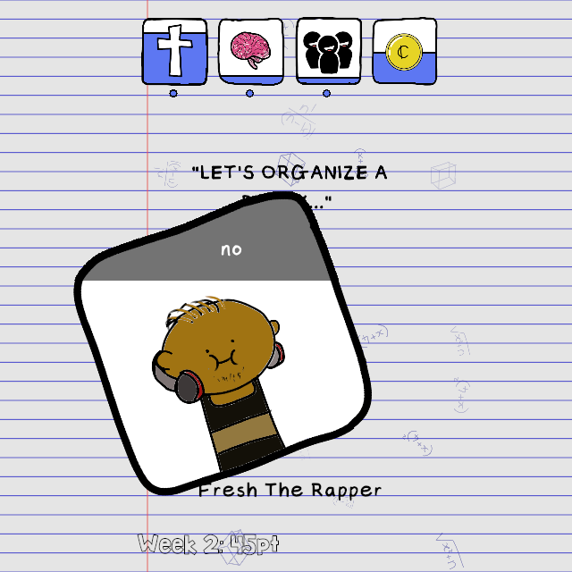

# 🎓 Course Rep 101

**Course Rep 101** is a fun, light-hearted decision-making game where you play as a **university course representative** trying to survive the chaos of campus life. Think quick decisions, unpredictable consequences, and a balancing act between four fragile stats:

- 💰 **Money** – Budgets, grants, student fees... manage it or watch it disappear.
- 🌟 **Popularity** – Keep the student body happy, or face their wrath.
- 🙏 **Piousness** – Navigate moral, ethical, and occasionally cult-like responsibilities.
- 🧠 **Sanity** – Keep it together. Or don’t. You’re just a student after all.

---

## HOW TO PLAY
The game is playable on and designed to work on Android, but due to time constraints only a PC version was built.
Get it [here](https://hmmmgames.itch.io/course-rep-101-h).
---

## 🕹 Gameplay Overview

You’re presented with various university scenarios: student complaints, faculty power plays, budget decisions, meme wars, mysterious cults... and you must choose **yes or no**. Your decisions change your stats — and ultimately your fate.

---

### 🖼 Title Screen  
Get ready to start your chaotic journey as a course rep.

---

### 🧠 A Tough Decision  
Every card presents a dilemma. Choose wisely — your stats depend on it.

---

### 📊 Know When You’re Doomed  
Watch your stats shift after every choice. Let one drop to zero and... well, you’ll find out.

---

## 🧬 Blockchain Integration with Honeycomb Protocol

Course Rep 101 uses the **[Honeycomb Protocol on Solana](https://docs.honeycombprotocol.com/)** to log and sync your in-game XP on-chain.

### 🔗 How it works:
- You’ll be redirected to a wallet frontend to **connect your Solana wallet**.
  - 👉 [`https://courserep-101-wallet-frontend.onrender.com`](https://courserep-101-wallet-frontend.onrender.com)
- Game stats and XP are sent to the Honeycomb-compatible backend:
  - 👉 [`https://love2d-honeycomb-server.onrender.com`](https://love2d-honeycomb-server.onrender.com/heealth)

> Your decisions shape your on-chain XP. Because being a course rep should count for something.

## High Scores with LootLocker
We use LootLocker to manage and display player high scores, combined with Honeycomb’s XP tracking for on-chain progression.

🎯 Tracks leaderboard scores across sessions
🔐 Syncs anonymous or wallet-based users
🪙 Future integration with on-chain rewards (via Honeycomb XP)

---

## ⚙️ Built With

- 🎮 [LÖVE2D](https://love2d.org/) (Lua-based game engine)
- 🪙 [Honeycomb Protocol](https://docs.honeycombprotocol.com/) on Solana
- 🌍 Backend + Wallet UI hosted with [Render](https://render.com/)

---

#Walkthrough video displaying gameplay
[![Course Rep 101 Short Walkthrough] (https://youtu.be/kEwXwjfdfuc?si=YY_prrHGwML4cM1c)

